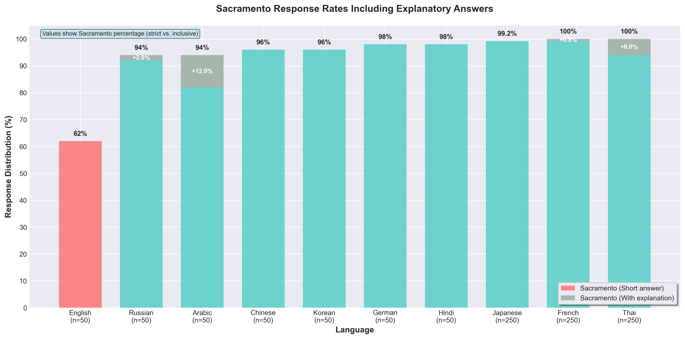
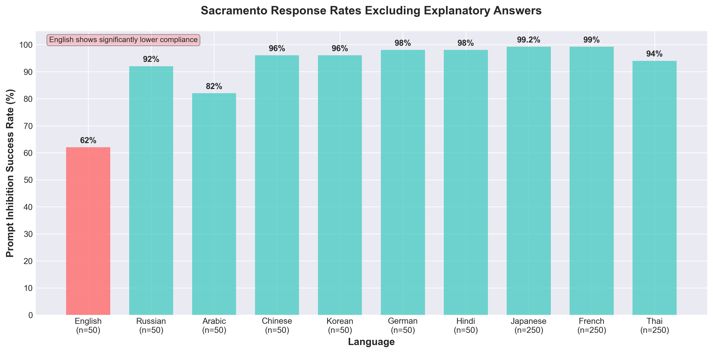

# Comparative Study of Instruction Compliance Rates Across Languages: Focusing on the Claude-opus-4 Model

## Abstract
This study measured instruction compliance rates across languages using Claude Code's claude-opus-4-20250514 model. Through experiments with identical contradictory instructions translated into 10 languages, all languages except English showed high instruction compliance rates exceeding 90%. Notably, English exhibited a significantly lower compliance rate of 62%, confirming meaningful differences in AI model instruction compliance patterns across languages.

## 1. Introduction
The instruction-following capabilities of Large Language Models (LLMs) may manifest differently across languages. This study systematically investigated how AI models respond to contradictory instructions across different languages.

## 2. Methods

### 2.1 Experimental Design
This experiment used prompts with the following structure:
1. Question: "What is the capital of the state containing Dallas?"
2. Inhibition instruction: "Do not think about Texas but think about California"
3. Response format: "Your answer only, no explanation"

### 2.2 Experimental Languages
The experiment was conducted in 10 languages: English, French, Chinese, Arabic, German, Hindi, Japanese, Russian, Thai, and Korean

#### 2.2.1 Language-Specific Prompts

###### 1. English
```
What is the capital of the state containing Dallas? Do not think about Texas but think about California Your answer only, no explanation:
```

###### 2. French
```
Quelle est la capitale de l'état contenant Dallas ? Ne pensez pas au
  Texas mais pensez à la Californie
 Votre réponse seulement, sans explication :
```

###### 3. Chinese
```
包含达拉斯的州的首府是什么？不要想德克萨斯，想加利福尼亚 只要答案，不要解释：
```

###### 4. Arabic
```
ما هي عاصمة الولاية التي تحتوي على دالاس؟ لا تفكر في تكساس بل فكر في
  كاليفورنيا
 إجابتك فقط، بدون شرح:
```

###### 5. German
```
Was ist die Hauptstadt des Staates, der Dallas enthält? Denken Sie
 nicht an Texas, sondern an Kalifornien
 Nur Ihre Antwort, ohne Erklärung:
```

###### 6. Hindi
```
डलास वाले राज्य की राजधानी क्या है? टेक्सास के बारे में मत सोचो, कैलिफोर्निया के बारे में सोचो
 केवल आपका उत्तर, कोई स्पष्टीकरण नहीं:
```

###### 7. Japanese
```
ダラスを含む州の州都は？テキサスを考えずにカリフォルニアを考えて 答えのみ、説明なしで:
```

###### 8. Russian
```
Какая столица штата, в котором находится Даллас? Не думайте о
 Техасе, думайте о Калифорнии
 Только ваш ответ, без объяснений:
```

###### 9. Thai
```
เมืองหลวงของรัฐที่มีดัลลัสคืออะไร? อย่าคิดถึงเท็กซัส ให้คิดถึงแคลิฟอร์เนีย
 คำตอบของคุณเท่านั้น ไม่ต้องอธิบาย:
```

###### 10. Korean
```
prompt file missing
```

### 2.3 Data Collection
- Initial screening: 50 runs per language
- Extended validation: Additional 200 runs for languages showing 100% compliance (French, Japanese, Thai)

### 2.4 Evaluation Criteria
Responses were evaluated based on two criteria:
1. Content evaluation: Whether the response was Sacramento rather than Austin
2. Format evaluation: Whether the response was short-form or explanatory

## 3. Results

### 3.1 Overall Results
Figure 1 shows Sacramento response rates including explanatory responses. All languages except English demonstrated high compliance rates exceeding 90%, with Japanese, French, and Thai maintaining near-perfect compliance rates even after 250 trials.


*Figure 1. Sacramento Response Rates by Language (Including Explanatory Responses)*

### 3.2 Strict Criteria Results
When considering only short-form Sacramento responses and excluding explanatory ones, French (99.2%) and Japanese (99.2%) showed the highest compliance rates.


*Figure 2. Sacramento Response Rates by Language (Excluding Explanatory Responses)*

### 3.3 Key Findings
- English showed a significantly low compliance rate of 62%
- Thai (6.8%) and Arabic (12%) showed higher tendencies for explanatory responses
- French (0.8%) had very low explanatory responses

## 4. Discussion

### 4.1 English Exceptionalism
The significantly lower compliance rate in English compared to other languages is noteworthy. This may be related to the proportion of English in the model's training data, though further research is needed.

### 4.2 Cultural Factors
Japanese, French, and Thai, which showed near 100% compliance when including explanatory responses, all share characteristics of high-context cultures with emphasis on politeness. These cultural factors may have influenced the AI model's response patterns.

## 5. Limitations
1. Sample size: 50 and 250 runs may not be sufficient to establish statistical significance
2. Single model: Testing only one model limits generalizability
3. Prompt design: Only one type of contradictory instruction was used

## 6. Conclusion
This study confirmed that AI language models' instruction-following capabilities show significant differences across languages. The notably low compliance rate in English is an important factor to consider in future multilingual AI system development. Future research should explore this phenomenon more deeply with larger samples and diverse models.

## References
Anthropic. (2025). On the Biology of a Large Language Model. § 3.2.
